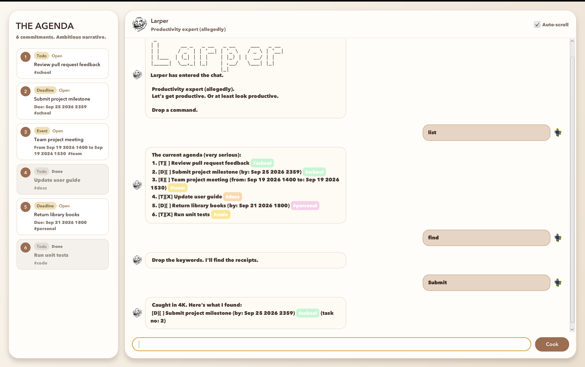

# Larper User Guide

Larper is a desktop task manager for todos, deadlines, and events. It combines fast, command-based input with a
graphical agenda that keeps your tasks visible while you work.

Larper is a productivity expert, allegedly.



## Contents

- [Quick start](#quick-start)
- [Features](#features)
  - [Command format](#command-format)
  - [Viewing help: `help`](#viewing-help-help)
  - [Adding a todo: `todo`](#adding-a-todo-todo)
  - [Adding a deadline: `deadline`](#adding-a-deadline-deadline)
  - [Adding an event: `event`](#adding-an-event-event)
  - [Listing tasks: `list`](#listing-tasks-list)
  - [Marking a task as done: `mark`](#marking-a-task-as-done-mark)
  - [Marking a task as not done: `unmark`](#marking-a-task-as-not-done-unmark)
  - [Deleting a task: `delete`](#deleting-a-task-delete)
  - [Finding tasks by text: `find`](#finding-tasks-by-text-find)
  - [Finding tasks by tag: `find tag`](#finding-tasks-by-tag-find-tag)
  - [Adding tags: `tag`](#adding-tags-tag)
  - [Removing tags: `untag`](#removing-tags-untag)
  - [Exiting Larper: `exit`](#exiting-larper-exit)
  - [Saving data](#saving-data)
  - [Editing the data file](#editing-the-data-file)
  - [Error handling](#error-handling)
- [FAQ](#faq)
- [Known issues](#known-issues)
- [Command summary](#command-summary)
- [Acknowledgements](#acknowledgements)

---

## Quick start

1. Ensure that Java `25` or later is installed on your computer.

   macOS users should install the
   [Java 25 JDK+FX distribution specified by the course](https://se-education.org/guides/tutorials/javaInstallationMac.html).

2. Download the latest `larper.jar` from the
   [GitHub Releases page](https://github.com/gwenlim89/ip/releases).
3. Place `larper.jar` in the folder you want to use as Larper's home folder.
4. Open a terminal in that folder and run:

   ```shell
   java -jar larper.jar
   ```

5. Wait for the Larper window to appear.
6. Type a command in the command box and press `Enter`, or select **Cook**.

Some commands to try:

- `todo read lecture notes #school` adds a todo tagged `school`.
- `deadline submit iP /by 2026-09-18 2359` adds a deadline.
- `event project meeting /from 2026-09-19 2pm /to 2026-09-19 4pm` adds an event.
- `list` shows all tasks in the chat.
- `help` shows a compact command reference inside Larper.

The left panel, **The Agenda**, displays task numbers, types, completion states, dates, and tags. The right panel
contains your conversation with Larper. Both panels update after a command changes the task list.

> [!TIP]
> Press the up and down arrow keys in the command box to revisit commands from the current session. Turn
> **Auto-scroll** off when you want to inspect an earlier message.

---

## Features

### Command format

- Words in `UPPER_CASE` are parameters supplied by you. For example, replace `DESCRIPTION` with `read notes`.
- Items in square brackets are optional. For example, `todo DESCRIPTION [#TAG]...` works with or without a tag.
- Items followed by `...` may be repeated. For example, `[#TAG]...` accepts `#school`, `#school #urgent`, or no tag.
- `NUMBER` is the positive task number displayed in **The Agenda**. Task numbers can change after a task is deleted.
- Commands are case-sensitive. Enter `todo`, not `Todo`.
- A task description cannot contain `|` because Larper uses that character to separate saved fields.
- Tags are one-word labels containing only letters and numbers.
- When creating a task, include `#` before each tag. The `tag`, `untag`, and `find tag` commands accept tags with or
  without `#`.
- Dates accept formats such as `2026-09-18`, `18/9/2026`, `18 Sep 2026`, `Sep 18 2026`, and `friday`.
- Times accept formats such as `2359`, `23:59`, `2pm`, and `2:30pm`. Enter `no time` when no specific time applies.

### Viewing help: `help`

Shows a compact list of Larper's commands.

**Format:** `help`

### Adding a todo: `todo`

Adds a task without a date or time.

**Format:** `todo DESCRIPTION [#TAG]...`

**Examples:**

- `todo read lecture notes` adds an untagged todo.
- `todo clean desk #home` adds a todo tagged `home`.
- `todo prepare slides #school #urgent` adds a todo with two tags.

### Adding a deadline: `deadline`

Adds a task that must be completed by a date and, optionally, a time.

**Format:** `deadline DESCRIPTION [#TAG]... /by DATE [TIME]`

- `/by` must appear after the description and any tags.
- If `TIME` is omitted, Larper asks for it. Reply with a supported time or `no time`.

**Examples:**

- `deadline submit iP /by 2026-09-18 2359` adds a deadline with a time.
- `deadline return library book #personal /by 18 Sep 2026 no time` adds a deadline without a specific time.

### Adding an event: `event`

Adds a task that takes place between a start and an end date/time.

**Format:** `event DESCRIPTION [#TAG]... /from START_DATE [START_TIME] /to END_DATE [END_TIME]`

- `/from` and `/to` must appear in that order.
- If a start or end time is omitted, Larper asks for it. Reply with a supported time or `no time`.

**Examples:**

- `event project meeting /from 2026-09-19 2pm /to 2026-09-19 4pm` adds a two-hour event.
- `event workshop #school /from friday 9am /to friday 11am` adds a tagged event using a weekday.

### Listing tasks: `list`

Shows every task in the chat. The same tasks remain visible in **The Agenda**.

**Format:** `list`

### Marking a task as done: `mark`

Marks an unfinished task as completed.

**Format:** `mark NUMBER`

**Example:** `mark 2` marks task 2 as done.

### Marking a task as not done: `unmark`

Returns a completed task to its unfinished state.

**Format:** `unmark NUMBER`

**Example:** `unmark 2` marks task 2 as not done.

### Deleting a task: `delete`

Permanently removes the specified task from the agenda.

**Format:** `delete NUMBER`

- The number must refer to an existing task.
- Tasks after the deleted task receive new numbers.

**Example:** `delete 3` deletes task 3.

### Finding tasks by text: `find`

Searches task descriptions for a phrase. It also returns a task when the entire search phrase exactly matches one of
its tags. The search is case-insensitive.

**Format:**

1. Enter `find`.
2. Enter `SEARCH_PHRASE` when Larper prompts you.

**Example:** Enter `find`, then enter `project` to find tasks whose descriptions contain `project`.

### Finding tasks by tag: `find tag`

Finds tasks containing an exact tag. The search is case-insensitive.

**Format:** `find tag TAG`

**Examples:**

- `find tag school`
- `find tag #school`

Both examples find tasks tagged `school`.

### Adding tags: `tag`

Adds one or more tags to an existing task. Existing tags remain attached.

**Format:** `tag NUMBER TAG...`

**Examples:**

- `tag 1 school` adds the `school` tag to task 1.
- `tag 1 #school urgent` adds two tags to task 1.

### Removing tags: `untag`

Removes one or more tags from an existing task.

**Format:** `untag NUMBER TAG...`

**Example:** `untag 1 urgent` removes the `urgent` tag from task 1.

### Exiting Larper: `exit`

Ends the current Larper session.

**Format:** `exit`

In the GUI, the command box becomes disabled after `exit`. Close the window when you are done.

### Saving data

Larper automatically saves after `todo`, `deadline`, `event`, `mark`, `unmark`, `delete`, `tag`, and `untag`.
You do not need to save manually.

Data is stored relative to Larper's home folder:

```text
data/larperdata.txt
```

If the file is missing, Larper starts with an empty agenda and creates the file when it next saves a task change.

### Editing the data file

Advanced users may edit `data/larperdata.txt` directly while Larper is closed.

> [!CAUTION]
> Back up the data file before editing it. Larper skips malformed lines when loading and warns you which lines were
> skipped. Saving another task change rewrites the file using only the tasks that loaded successfully.

### Error handling

Larper displays command errors as highlighted messages. It handles common problems such as unknown commands, missing
descriptions, invalid task numbers, invalid tags, unsupported dates or times, and missing or malformed data files.

---

## FAQ

### Do I need to save manually?

No. Larper saves automatically after every command that changes the agenda.

### Where do task numbers come from?

Use the number shown beside a task in **The Agenda**. Check the number again after deleting a task because the
remaining tasks are renumbered.

### Why does Larper ask for a time after I enter a deadline or event?

Larper understood the date, but no time was provided. Enter a time such as `1400` or `2pm`, or enter `no time`.

### How do I move my tasks to another computer?

Move `larper.jar` and the `data` folder to the new computer. Keep the same folder structure so Larper can find
`data/larperdata.txt`.

---

## Known issues

1. Commands are case-sensitive.
2. Tags can contain only letters and numbers, with no spaces or punctuation.
3. The GUI command box accepts single-line commands only.

---

## Command summary

| Action | Format | Example |
| --- | --- | --- |
| View help | `help` | `help` |
| Add todo | `todo DESCRIPTION [#TAG]...` | `todo read notes #school` |
| Add deadline | `deadline DESCRIPTION [#TAG]... /by DATE [TIME]` | `deadline submit iP /by 2026-09-18 2359` |
| Add event | `event DESCRIPTION [#TAG]... /from START_DATE [START_TIME] /to END_DATE [END_TIME]` | `event meeting #school /from friday 2pm /to friday 4pm` |
| List tasks | `list` | `list` |
| Mark as done | `mark NUMBER` | `mark 2` |
| Mark as not done | `unmark NUMBER` | `unmark 2` |
| Delete task | `delete NUMBER` | `delete 3` |
| Find text | `find`, then `SEARCH_PHRASE` | `find`, then `project` |
| Find tag | `find tag TAG` | `find tag school` |
| Add tags | `tag NUMBER TAG...` | `tag 1 school urgent` |
| Remove tags | `untag NUMBER TAG...` | `untag 1 urgent` |
| Exit | `exit` | `exit` |

---

## Acknowledgements

- This project was built from the [SE-EDU Duke project template](https://github.com/se-edu/duke).
- The JavaFX GUI structure was adapted from the
  [SE-EDU JavaFX tutorial](https://se-education.org/guides/tutorials/javaFxPart1.html).
- This guide uses the
  [AddressBook Level 3 User Guide](https://se-education.org/addressbook-level3/UserGuide.html) as a structural
  reference and follows [GitHub's basic writing and formatting syntax](https://docs.github.com/en/get-started/writing-on-github/getting-started-with-writing-and-formatting-on-github/basic-writing-and-formatting-syntax).
- The Larper avatar uses the [Trollface image][trollface-image], created by Carlos Ramirez.
- The user avatar was adapted from this [Roblox character image][roblox-image].

[trollface-image]: https://upload.wikimedia.org/wikipedia/en/7/73/Trollface.png?utm_source=en.wikipedia.org&utm_campaign=index&utm_content=original
[roblox-image]: https://media.sketchfab.com/models/a86ea34c1bac433fb1e41918a2a9864f/thumbnails/26aef9c3f8f74b9d9674725164adf87b/a9ec07fca15a4e6b86b57bd2168259f2.jpeg
